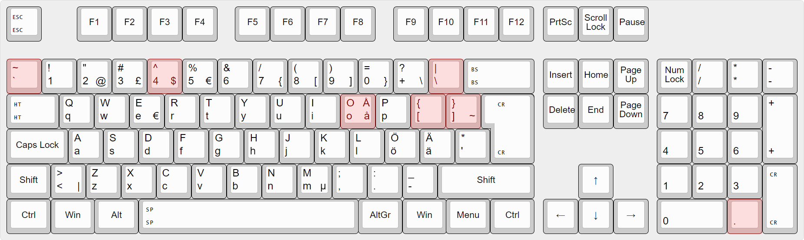

# Modified Finnish Keyboard Layout for Programmers

Inspired by https://github.com/ruohola/finner. Finner layout includes a lot of modifications and uses a US board as a base. This layout does the relevant modifications without touching anything else.

Modifications:
- `~` and `` ` `` are moved to the left of 1.
- `^` is moved to `Shift + 4`
- `{`, `}`, `[` and `]` are moved to the left of `Enter` (they are no longer dead keys)
- `\` and `|` are moved to the right of `?` (they are no longer dead keys)
- Numpad `,` is changed to `.`

Everyting else is the same as the default Finnish layout.

